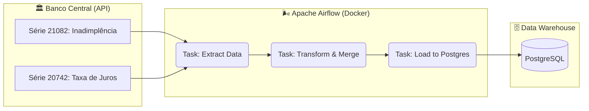

<div align="center">
  
  
  
  
  
</div>

# 🏦 Airflow Credit Data Pipeline

Pipeline de Engenharia de Dados **ELT (Extract, Load, Transform)** desenvolvido para automatizar a coleta, processamento e armazenamento de indicadores financeiros oficiais do Banco Central do Brasil.

Este projeto orquestra o ciclo de vida de dados de crédito utilizando **Apache Airflow** em ambiente containerizado (**Docker**), garantindo reprodutibilidade, escalabilidade e monitoramento.

---

## 📋 Sobre o Projeto

O objetivo deste projeto é criar uma base analítica histórica para estudos de **Risco de Crédito**, cruzando dois indicadores econômicos fundamentais disponibilizados pelo Sistema Gerenciador de Séries Temporais (SGS) do Banco Central:

1.  **Taxa de Inadimplência (PF):** O percentual da carteira de crédito com atraso superior a 90 dias.
2.  **Taxa Média de Juros (PF):** O custo médio do crédito para famílias.

**Business Value:**
O pipeline permite responder a perguntas estratégicas, como: *"Existe correlação direta entre o aumento da taxa de juros e a inadimplência nos meses subsequentes?"*, fornecendo dados limpos e consolidados para times de Analytics e Data Science.

---

## 🛠 Tech Stack

* **Orquestração:** Apache Airflow 2.x
* **Infraestrutura as Code:** Docker & Docker Compose
* **Data Warehouse:** PostgreSQL
* **Linguagem de Processamento:** Python (Pandas)
* **Fonte de Dados:** API de Dados Abertos do Banco Central (SGS)

---

## ⚙️ Arquitetura da Solução

O fluxo foi desenhado para ser resiliente a falhas e executado mensalmente:



## O Processo de Transformação

1.  **Extração:** Conexão com a API do BCB e download dos arquivos CSV brutos.

2.  **Transformação:**

    * Normalização de separadores (Padrão BR para US).
    * Conversão de tipos (String -> Float/Date).
    * **Join:** Cruzamento das duas séries temporais pela data de referência.

3.  **Carga:** Persistência dos dados tratados na tabela indicadores_credito_bcb no Postgres.

---

## 🚀 Como Executar
Este projeto utiliza Docker para subir todo o ambiente (Airflow + Banco de Dados) com um único comando, abstraindo instalações complexas.

**Pré-requisitos**

  * Docker Desktop instalado.

**Passo a Passo**

1.   **Clone o repositório:**

```Bash

git clone https://github.com/SEU-USUARIO/airflow-credit-data-pipeline.git
cd airflow-credit-data-pipeline
````
2.  **Suba a infraestrutura:**

```Bash

docker-compose up -d
Aguarde alguns minutos até que todos os containers estejam saudáveis.
```

3.  **Acesse o Airflow:**

    * Abra o navegador em: http://localhost:8080

    * Usuário: admin

    * Senha: admin

4.  **Configure a Conexão com o Banco:** No menu superior do Airflow, vá em Admin -> Connections, clique no (+) e preencha:

    * **Conn Id:** postgres_default

    * **Conn Type:** Postgres

    * **Host:** postgres

    * **Schema:** airflow

    * **Login:** airflow

    * **Password:** airflow

    * **Port:** 5432

5.  **Execute o Pipeline:** Ative a DAG bcb_credit_indicators_pipeline (botão ON/OFF) e clique no botão Play (Trigger DAG).

## 📊 Estrutura do Projeto

````Plaintext

airflow-credit-data-pipeline/
├── dags/
│   └── credito_elt.py      # Código Python da DAG (Lógica do Pipeline)
├── data/                   # Área de stage para arquivos (mapeado no Docker)
├── logs/                   # Logs de execução
├── docker-compose.yaml     # Definição da Infraestrutura (Airflow + Postgres)
└── README.md               # Documentação
````

## 📈 Resultado Final

Após a execução com sucesso (caixinhas verdes), os dados estarão disponíveis no banco de dados PostgreSQL interno, prontos para serem conectados a ferramentas de BI (PowerBI/Tableau) ou consumidos por modelos de Machine Learning.
